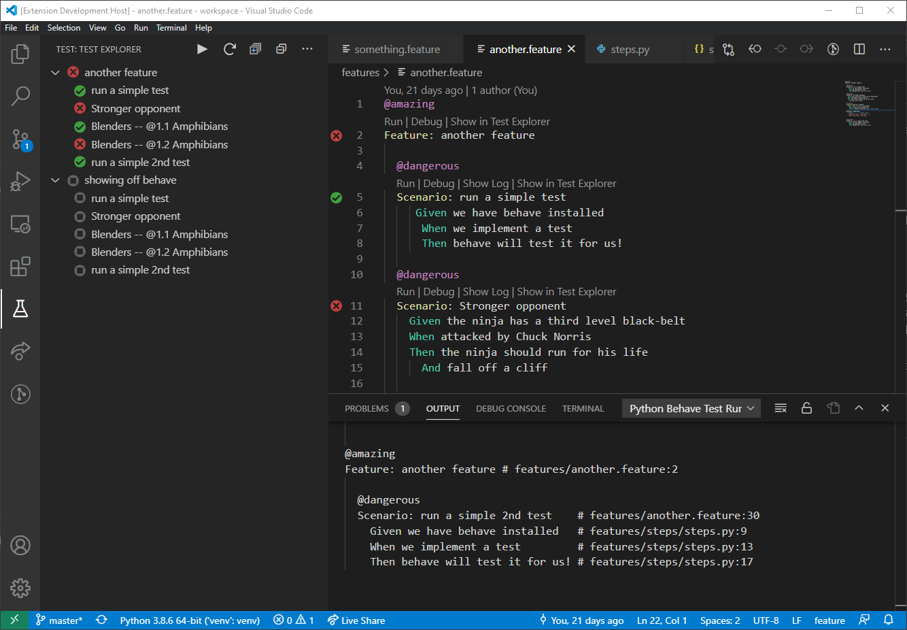

# Python Behave Test Adapter for Test Explorer UI

This is a test adapter to run and debug Python Behave tests in VS Code.

This extension allows you to run your [Python Behave Tests](https://behave.readthedocs.io) with the [Test Explorer UI](https://marketplace.visualstudio.com/items?itemName=hbenl.vscode-test-explorer).

## Getting started

* Install [Python Behave Test Adapter](https://marketplace.visualstudio.com/items?itemName=tbd) extension
* Make sure Python tool is setup correctly
* You will see both tests in Test Explorer UI and Code Lens inside your code

## Features

* See all Behave tests in Test Explorer UI grouped by features
* Run either all tests, whole feature or individual tests
* Adds Codelens to your feature files to run and debug tests
* See test output live as it runs
* See each tests log after it run for individual inspection

## Troubleshooting

By default the extension output channel is disabled.  
You can add `"pyhtonBehave.logpanel": true` to your `settings.json` file to show the output panel
which will write any errors or failures to help you diagnose problems.
